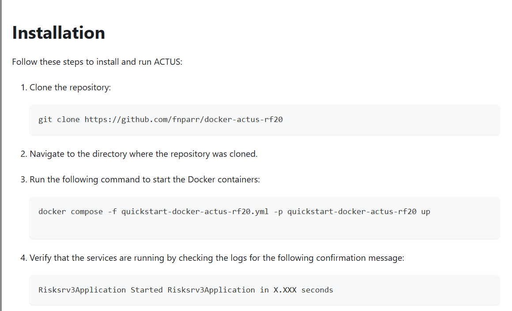
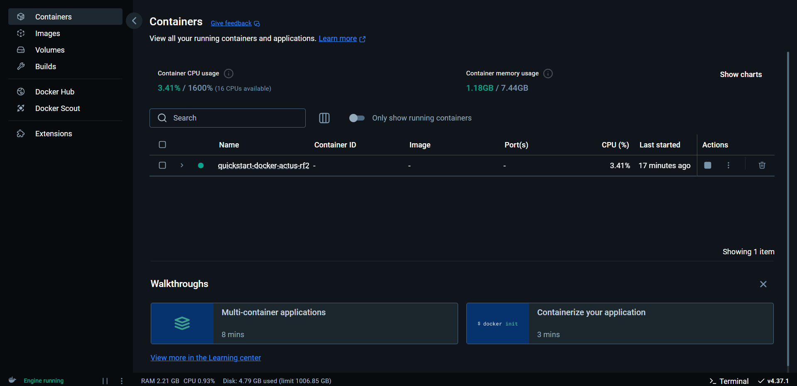
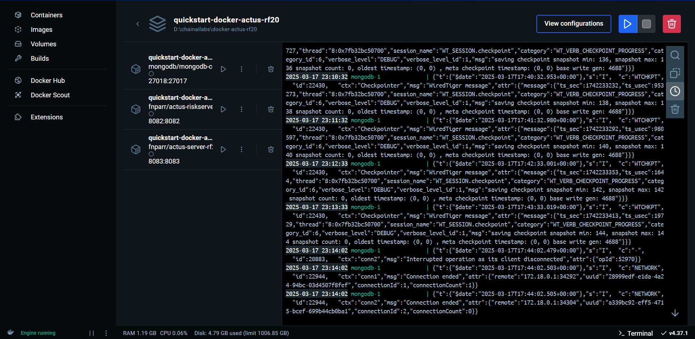
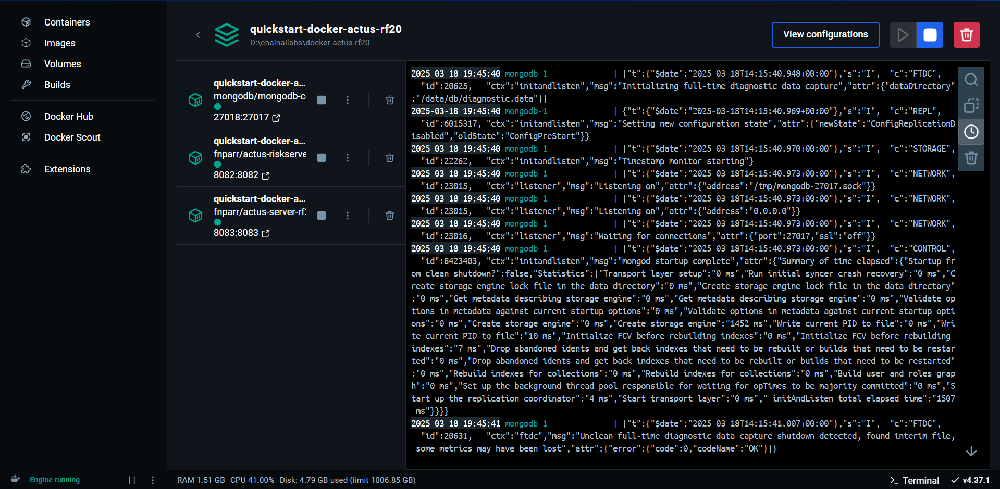
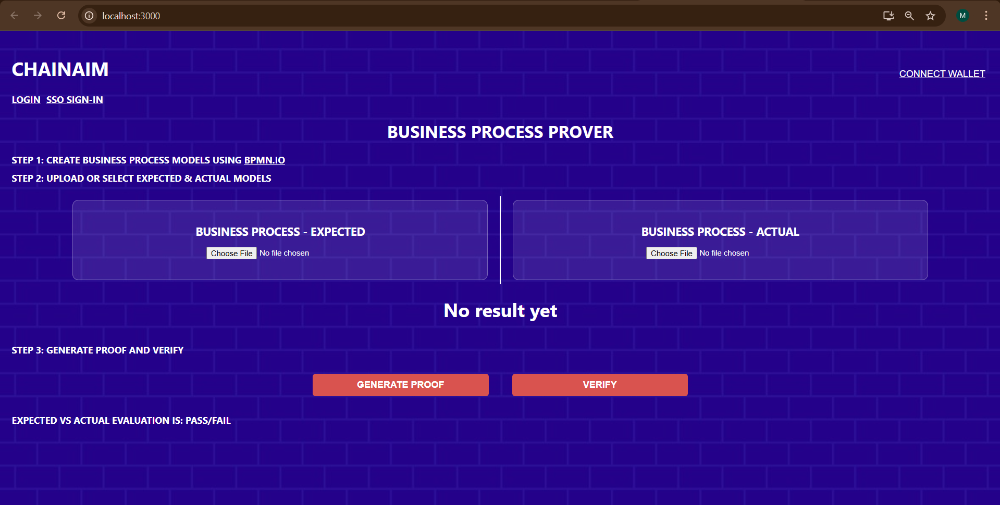

## ZK_PRET PROOF ENGINE FOR TOKENIZATION 

We are at the begining stages of transitioning from a retail-focued mode to a instibutional adoption mode, and Defi and Tradfi Lines are merging, emerging in to Insticutional Defi, and Real world assets Tokenization. 

ZK-PRET is focused on filling the gaps Web3 systems need to fill to accomodate Web2 Tradfi, with unified business systems standards, processes, data integrity and regulatory compliance. 

ZK_PRET is a business infrastrucure layer for enabling Tokenization usecases, where off-chain data, proceses and compliance are effectively represented on-chain, along side on-chain constucts.

These include 

      A deep Composition Engine 
              -For deep composed proofs of multi-level compliance at the local, EXPORT-IMPORT per corridor and Global Legal Entity Identifieer. - Based on the global GLEIF standard, 
               and confgurable data sources per jurisdiction.
               
              -For deep data integriry of new forms of tokenized assets in Supply chain Finance like Bill of Lading Invoices ( the title for most intetnational trade invoicing ) - based on the DCSA stanards.
              https://dcsa.org/standards/bill-of-lading
              
      A business Process Prover 
               -  For Standards baesd proof os business processes, per Business Process modeling Notaation ( BPMN 2.0 )
                 https://www.omg.org/spec/BPMN/2.0/
               
      A Risk Prover 
               - Based on Unified standards in ACTUS financial framework , accross Tradfi and Defi - for all of finance for overall compliance and risk management 

                 https://www.actusfrf.org

      A Registry
               - For a reference registrty architecture.


             
  


## ZK PRET Architecture:

ZK-PRET is set up to run as individual modules that can be used for many RWA tokenization usecases, and also a reference implementation for end2ed Supply chain Finance. 


## IMPACT :

The Internatunal Trade Finance is a 2-3 T opportunity, currently under-penerated even in TradFi., and overall Supply chain Finance is 16 T. 

The financiers are looking for systems that can provide risk mitigations as they are looking in to next generation tokenization. 

While promiting initial usecases in compliannt defi, These capabilities opens up formnation of new types of hyrbid financial instruments combining traditional and defi constructes for newer yeild products that are sustainable and compliant. 


## The Presentation 


[ZK-PRET-RWA-MidPoint-Review.pptx](https://github.com/user-attachments/files/19332800/ZK-PRET-RWA-MidPoint-Review.pptx)


---
## RUNNING THE IMPLEMENTAITON

Git clone https://github.com/chainaim3003/ZK-PRET-DEV-V2.git

### RUNNING TEST CASES FROM NODE RUNTIME

Open the terminal navigate to the below path:

1. \ZK-PRET-DEV-V2\zkapps\ZK-PRET-DEV\PRET-ZK-RWA-SCF>
```powershell
npm install
```
2. \ZK-PRET-DEV-V2\zkapps\ZK-PRET-DEV\PRET-ZK-RWA-SCF>
```powershell
npm run build
```
3. \ZK-PRET-DEV-V2\zkapps\ZK-PRET-DEV\PRET-ZK-RWA-SCF>
```powershell
node ./build/src/CorporateRegistrationVerificationTestWithSign.js
```

4. \ZK-PRET-DEV-V2\zkapps\ZK-PRET-DEV\PRET-ZK-RWA-SCF>
```powershell
node ./build/src/EXIMVerificationTestWithSign.js
```

5. \ZK-PRET-DEV-V2\zkapps\ZK-PRET-DEV\PRET-ZK-RWA-SCF>
```powershell
node ./build/src/GLEIFVerificationTestWithSign.js
```

6.\ZK-PRET-DEV-V2\zkapps\ZK-PRET-DEV\PRET-ZK-RWA-SCF>
```powershell
node ./build/src/ComposedRecurrsiveSCF3LevelProofs.js
```

7.\ZK-PRET-DEV-V2\zkapps\ZK-PRET-DEV\PRET-ZK-RWA-SCF>
```powershell
node ./build/src/ComposedRecursive3LevelVerificationTestWithSign.js
```

8. \ZK-PRET-DEV-V2\zkapps\ZK-PRET-DEV\PRET-ZK-RWA-SCF>
```powershell
node ./build/src/BusinessStandardDataIntegrityVerificationTest.js
```

9. \ZK-PRET-DEV-V2\zkapps\ZK-PRET-DEV\PRET-ZK-RWA-SCF>
```powershell
node ./build/src/BusinessProcessIntegrityVerificationTest.js "a(cb|bc)d(ef|f)g" "abcdefg"
```


10. \ZK-PRET-DEV-V2\zkapps\ZK-PRET-DEV\PRET-ZK-RWA-SCF>
```powershell
node ./build/src/BusinessProcessIntegrityVerificationFileTest.js bpmn-SCF-Example-Process-Expected.bpmn bpmn-SCF-Example-Execution-Actual-Accepted-1.bpmn result.txt
```
Instead of "bpmn-SCF-Example-Execution-Actual-Accepted-1.bpmn" ypu can give any of the Accepted or Rejected ***.bpmn*** file from this path `ZK-PRET-DEV-V2\zkapps\ZK-PRET-DEV\PRET-ZK-RWA-SCF\`

#### **Docker should be in running for below cases**

11.\ZK-PRET-DEV-V2\zkapps\ZK-PRET-DEV\PRET-ZK-RWA-SCF>

The Below Two Comment Pass The Test

```powershell
node build/src/RiskLiquidityACTUSVerifierTest_basel3_Withsign.js 0.5
```
```powershell
node build/src/RiskLiquidityACTUSVerifierTest_basel3_Withsign.js 1
```
The Below Comment Fail The Test

```powershell
node build/src/RiskLiquidityACTUSVerifierTest_basel3_Withsign.js 2
```

12. \ZK-PRET-DEV-V2\zkapps\ZK-PRET-DEV\PRET-ZK-RWA-SCF>

The Below Comment Pass The Test

```powershell
 node ./build/src/RiskLiquidityACTUSVerifierTest_adv_zk_WithSign.js 8 
```
The Below Comment Fail The Test

```powershell
 node ./build/src/RiskLiquidityACTUSVerifierTest_adv_zk_WithSign.js 9 
```

For the above two file RiskLiquidityACTUSVerifierTest docker should be in running

***

### TO RUN THE ACTUS VERIFIER TEST YOU NEED ACTUS SERVER AND THESE ARE THE STEPS FOR INSTALLING AND RUNNING DOCKER CONTAINER.

**Install the docker desktop in your system:** https://www.docker.com/products/docker-desktop/

**Go to the website:**   https://documentation.actusfrf.org/docs/quickstart

*Complete the installation:* 



After the installation make sure the docker looks  like this



If it looks like this

 

Then click the play button 

After clicking its look like 
 


(OR)

For running the above 3 to 8 node commands in single run refer the below:

\ZK-PRET-DEV-V2\zkapps\ZK-PRET-DEV\PRET-ZK-RWA-SCF> 
```powershell
node ./build/src/runAllTests.js
```
---

### RUNNING bussiness-process-prover on the server for the SMART CONTRACT VERIFIER ON MINA BLOCKCHAIN ( LOCAL )

Please try  https://zk-pret-bpmn-prover-dev.vercel.app/ 

The implemementation currently supports SUPPLY CHAIN FINANCE bpmn model as an example, but any conforming bpmn 2.0 models that have a definite start and end, and non-cyclical loops  can be proved. 


For trying out , please use the expected and  actual or rejecred files from teh bpmn-docs directory. 

For the Supply Chain Finannce business process model example, the legend is the following : 

a = Purchase Order b = Booking c = Invoice d = Shipping Instruction e = Other Instruments F = Bill of Lading G = Received


### RUNNING bussiness-process-prover-local FRONTEND AND BACKEND ( In this implementation, the circuit is executed in a ZK program, and the proof it produces is verified in the smart contract ).

1. \ZK-PRET-DEV-V2\zkapps\ZK-PRET-DEV\PRET-ZK-RWA-SCF>
 ```powershell
 npm install
 ```

2. \ZK-PRET-DEV-V2\zkapps\ZK-PRET-DEV\PRET-ZK-RWA-SCF> 
```powershell
npm run build
```

**Open the new terminal**

3. \ZK-PRET-DEV-V2\zkapps\ZK-PRET-DEV\PRET-ZK-RWA-SCF\bussiness-process-prover-local> 
```powershell
npm install
```


**Open the new terminal**

4. \ZK-PRET-DEV-V2\zkapps\ZK-PRET-DEV\PRET-ZK-RWA-SCF\bussiness-process-prover-local\backend> 
```powershell
npm install express
```

5. \ZK-PRET-DEV-V2\zkapps\ZK-PRET-DEV\PRET-ZK-RWA-SCF\bussiness-process-prover-local\backend> 
```powershell
node server.js
```

Server is running on http://localhost:4000

**Open the new terminal**

6. \ZK-PRET-DEV-V2\zkapps\ZK-PRET-DEV\PRET-ZK-RWA-SCF\bussiness-process-prover-local\frontend> 
```powershell
npm install react-scripts
```

7. \ZK-PRET-DEV-V2\zkapps\ZK-PRET-DEV\PRET-ZK-RWA-SCF\bussiness-process-prover-local\frontend> `npm start`
```powershell
npm start
```

After npm start the webpage will open on http://localhost:3000

 

**In BUSINESS PROCESS – EXPECTED**

•	choose the   ***bpmn-SCF-Example-Process-Expected.bpmn***   file from  
ZK-PRET-DEV-V2\zkapps\ZK-PRET-DEV\PRET-ZK-RWA-SCF\bussiness-process-prover-local\bpmn – docs\

**In BUSINESS PROCESS – ACTUAL** 

•	choose the   ***accepted or rejected***   file from  
ZK-PRET-DEV-V2\zkapps\ZK-PRET-DEV\PRET-ZK-RWA-SCF\bussiness-process-prover-local\bpmn – docs\ 

After choosing the two files it looks like this


 
then click **Process Both Files**


 
then click **Process Both Files**

