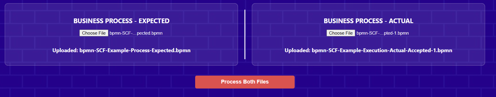

## ZK-PRET Proof Engine for Tokenization  

### Institutional DeFi and RWA Tokenization  
We are at the **beginning** stages of transitioning from retail-speculation to institutional adoption, with DeFi and TradFi lanes merging into **Institutional DeFi** and Real World Asset (RWA) tokenization.  

ZK-PRET focuses on filling gaps in Web3 systems to accommodate Web2 TradFi through **unified business standards**, processes, data integrity, and regulatory compliance.  

---

### Core Components  
ZK-PRET is a **business infrastructure layer** enabling tokenization use cases by effectively representing off-chain data, processes, and compliance on-chain alongside on-chain constructs.  

#### 1. Deep Composition Engine  
- **Multi-Level Compliance Proofs**:  
  - Validates compliance across jurisdictional layers (local, export-import corridors, global Legal Entity Identifier).  
  - Based on the **GLEIF standard** with configurable data sources per jurisdiction.  
- **Data Integrity Assurance**:  
  - Secures tokenized assets (e.g., Bill of Lading invoices) using **DCSA standards** for international trade invoicing.  
  - [DCSA Bill of Lading Standards](https://dcsa.org/standards/bill-of-lading)  

#### 2. Business Process Prover  
- **BPMN 2.0 Compliance**:  
  - Executes proofs for business processes modeled under **Business Process Model and Notation (BPMN 2.0)**.  
  - [BPMN 2.0 Specification](https://www.omg.org/spec/BPMN/2.0/)  

#### 3. Risk Prover  
- **ACTUS Financial Framework**:  
  - Unifies risk assessment across TradFi and DeFi using the **ACTUS standard** for financial contracts.  
  - [ACTUS Framework](https://www.actusfrf.org)  

#### 4. Registry  
- **Reference Registry Architecture**:  
  - Provides a decentralized registry for tokenized assets, ensuring interoperability between legacy and blockchain systems.  


ZK-PRET operates as **individual modules** adaptable to diverse RWA use cases, with a **reference implementation** for end-to-end supply chain finance.  


### Financial Opportunities 
The financiers are looking for systems that can provide risk mitigations as they are looking in to next generation tokenization.
While promoting initial use cases in compliant defi, These capabilities opens up formation of new types of hybrid financial instruments combining traditional and defi constructions for newer yield products that are sustainable and compliant.

- **International Trade Finance**: A **$2-3T opportunity**, underpenetrated even in TradFi.  
- **Supply Chain Finance**: A **$16T market**, driven by demand for risk-mitigated tokenization.  
The Internatunal Trade Finance is a 2-3 T opportunity, currently under-penerated even in TradFi., and overall Supply chain Finance is 16 T.


### Innovation Drivers  
- **Risk Mitigation**: Systems providing cryptographic proof of asset provenance and process adherence.  
- **Hybrid Financial Instruments**: Combining traditional collateral (e.g., invoices) with DeFi liquidity pools for sustainable, compliant yield products.  


## The Presentation 
[ZK-PRET-RWA-MidPoint-Review-Presented.pptx](https://github.com/user-attachments/files/19946371/ZK-PRET-RWA-MidPoint-Review-Presented.pptx)


## Running the Implementation

This document provides instructions for running the ZK-PRET-DEV-V2 implementation.

**1. Clone the Repository:**

```bash
git clone https://github.com/chainaimlabs/ZK-PRET-TEST-V3.git
```

### Running Test Cases from Node Runtime

Navigate to the following directory in your terminal:

```
cd /ZK-PRET-DEV-V3
```

Then, execute the following commands in sequence:

**1. Install Dependencies:**

```bash
npm install
```

**2. Build the Project:**

```bash
npm run build
```

**3. Run Test Cases:**

Execute each of the following commands to run individual test cases:

**CorporateRegistration :**
  *  TESTNET

     ```bash
     node ./build/tests/with-sign/CorporateRegistrationVerificationTestWithSign.js "U01112TZ2022PTC039493" "TESTNET"
     ```
  *  MAINNET
     
     ```bash
     node ./build/tests/with-sign/CorporateRegistrationVerificationTestWithSign.js "U01112TZ2022PTC039493" "MAINNET"
     ```
  *  LOCAL
    
     ```bash
     node ./build/tests/with-sign/CorporateRegistrationVerificationTestWithSign.js "zenova_mca" "LOCAL"
     ```
   **Note:** 
   * For `CorporateRegistrationVerificationTestWithSign` in TESTNET,MAINNET you can replace `"U01112TZ2022PTC039493"` with your own `CIN`
   * For LOCAL you can relpace `"zenova_mca"` with your own CompanyName
 ---
**EXIM :**

  * TESTNET
  
    ```bash
    node ./build/tests/with-sign/EXIMVerificationTestWithSign.js "palani" "TESTNET"
    ```
  * MAINNET
    
    ```bash
    node ./build/tests/with-sign/EXIMVerificationTestWithSign.js "palani" "MAINNET"
    ```
  * LOCAL
    
    ```bash
    node ./build/tests/with-sign/EXIMVerificationTestWithSign.js "palani" "LOCAL"
    ```
   **Note:** 
   * For `EXIMVerificationTestWithSign` you can relpace `"palani"` with your own CompanyName
---

**GLEIF :**

  * TESTNET
  
    ```bash
    node ./build/tests/with-sign/GLEIFVerificationTestWithSign.js "SREE PALANI ANDAVAR AGROS PRIVATE LIMITED" 'TESTNET'
    ```
  * MAINNET
    
    ```bash
    node ./build/tests/with-sign/GLEIFVerificationTestWithSign.js "SREE PALANI ANDAVAR AGROS PRIVATE LIMITED" 'MAINNET'
    ```
  * LOCAL
    
    ```bash
    node ./build/tests/with-sign/GLEIFVerificationTestWithSign.js "zenova_gleif" 'LOCAL'
    ```
   **Note:** 
   * For `GLEIFVerificationTestWithSign` you can relpace `"SREE PALANI ANDAVAR AGROS PRIVATE LIMITED"` with your own CompanyName
---
**BusinessStandardDataIntegrity**
```bash
node ./build/tests/with-sign/BusinessStandardDataIntegrityVerificationTest.js .\src\data\scf\actualBL1.json
```
---
**BusinessProcessIntegrity**

```bash
node ./build/tests/with-sign/BusinessProcessIntegrityVerificationFileTestWithSign.js 'SCF' src/data/scf/process/bpmn-SCF-Example-Process-Expected.bpmn src/data/scf/process/bpmn-SCF-Example-Execution-Actual-Accepted-1.bpmn result.txt
```

**Note:** 

* For the `BusinessProcessIntegrityVerificationFileTestWithSign.js` test, you can replace `"bpmn-SCF-Example-Execution-Actual-Accepted-1.bpmn"` with any of the `*.bpmn` files located in the `ZK-PRET-DEV-V3\src\data\scf\process\` directory (Accepted or Rejected).
* You can replace `SCF` with `STABLECOIN` or `DVP`

## Business Process Prover for StableCoin Regulatory processes 

The process model for the steps of the governance of the issuance processes, and the periodic auditing is modeled , and valid paths to compliance produces a proof, and non compliance does not produce a proof.


## Passing Case 

node ./build/tests/with-sign/BusinessProcessIntegrityVerificationFileTestWithSign.js "STABLECOIN" src/data/STABLECOIN/process/bpmnCircuitSTABLECOIN-expected.bpmn src/data/STABLECOIN/process/bpmnCircuitSTABLECOIN-accepted1.bpmn result.txt
Expected BPMN File Name: src/data/STABLECOIN/process/bpmnCircuitSTABLECOIN-expected.bpmn
Actual BPMN File Name: src/data/STABLECOIN/process/bpmnCircuitSTABLECOIN-accepted1.bpmn

## Failing Case 

node ./build/tests/with-sign/BusinessProcessIntegrityVerificationFileTestWithSign.js "STABLECOIN" src/data/STABLECOIN/process/bpmnCircuitSTABLECOIN-expected.bpmn src/data/STABLECOIN/process/bpmnCircuitSTABLECOIN-rejected1.bpmn result.txt
Expected BPMN File Name: src/data/STABLECOIN/process/bpmnCircuitSTABLECOIN-expected.bpmn
Actual BPMN File Name: src/data/STABLECOIN/process/bpmnCircuitSTABLECOIN-rejected1.bpmn


## Business Process Prover for Supply Chain Delivery Versus Payments processes

The process model for the deliveruVersusPayment processes for Supply chain processes is modeled , and valid paths to compliance produces a proof, and non compliance does not produce a proof.


## Passing Case 

node ./build/tests/with-sign/BusinessProcessIntegrityVerificationFileTestWithSign.js "DVP" src/data/DVP/process/bpmnCircuitDVP-expected.bpmn src/data/DVP/process/bpmnCircuitDVP-rejected1.bpmn result.txt
Expected BPMN File Name: src/data/DVP/process/bpmnCircuitDVP-expected.bpmn
Actual BPMN File Name: src/data/DVP/process/bpmnCircuitDVP-accepted1.bpmn

## Failing Case 

node ./build/tests/with-sign/BusinessProcessIntegrityVerificationFileTestWithSign.js "DVP" src/data/DVP/process/bpmnCircuitDVP-expected.bpmn src/data/DVP/process/bpmnCircuitDVP-rejected1.bpmn result.txt
Expected BPMN File Name: src/data/DVP/process/bpmnCircuitDVP-expected.bpmn
Actual BPMN File Name: src/data/DVP/process/bpmnCircuitDVP-rejected1.bpmn


```bash
node ./build/tests/with-sign/ComposedRecursive3LevelVerificationTestWithSign.js
```

**4. Risk Liquidity ACTUS Verifier Tests:**

*   **Passing Tests:**

Either use the actus server hosted locally on http://localhost:8083 using `ACTUS_NODE_LOCAL` or the online actus server http://98.84.165.146:8083 using `ACTUS_NODE_REMOTE`
 ```bash
node ./build/tests/with-sign/RiskLiquidityACTUSVerifierTest_basel3_Withsign.js 0.5 http://98.84.165.146:8083/eventsBatch
```
or
```bash
node ./build/tests/with-sign/RiskLiquidityACTUSVerifierTest_basel3_Withsign.js 1 http://98.84.165.146:8083/eventsBatch
```
    
*   **Test to prove Failing case:**

    ```bash
    node ./build/tests/with-sign/RiskLiquidityACTUSVerifierTest_basel3_Withsign.js 2 http://98.84.165.146:8083/eventsBatch
    ```
*   **RiskLiquidityACTUSVerifierTest_adv_zk_Withsign.js Tests:**
    *   **Passing Test:**

        ```bash
        node ./build/tests/with-sign/RiskLiquidityACTUSVerifierTest_adv_zk_WithSign.js 8 http://98.84.165.146:8083/eventsBatch
        ```
    *   **Test to prove Failing case:**

        ```bash
        node ./build/tests/with-sign/RiskLiquidityACTUSVerifierTest_adv_zk_WithSign.js 9 http://98.84.165.146:8083/eventsBatch
        ```

    *   **Important:** Docker needs to be running for the `RiskLiquidityACTUSVerifierTest_adv_zk.js` and `RiskLiquidityACTUSVerifierTest_adv_zk_WithSign.js` tests.

**5. Run all tests**
   Alternatively, to run test cases in one go:

```bash
node ./build/tests/with-sign/runAllTests.js
```

### Setting up ACTUS Verifier with Docker

To run the ACTUS verifier tests, you need to set up the ACTUS server using Docker.

**1. Install Docker Desktop:**

Download and install Docker Desktop from: [https://www.docker.com/products/docker-desktop/](https://www.docker.com/products/docker-desktop/)

**2. Follow the ACTUS Quickstart Guide:**

Refer to the official ACTUS documentation for installation instructions: [https://documentation.actusfrf.org/docs/quickstart](https://documentation.actusfrf.org/docs/quickstart)

**3. Verify Docker is Running:**

After installation, ensure that Docker is running. The Docker Desktop interface should indicate that the Docker engine is active. If it shows a "stopped" state, click the "play" button to start it.

### Running the Business Process Prover

#### Hosted Vercel Frontend

You can test the business process prover using the hosted Vercel frontend:

[https://zk-pret-bpmn-prover-test.vercel.app/](https://zk-pret-bpmn-prover-test.vercel.app/)

The implementation currently supports the Supply Chain Finance BPMN model as an example.  Any conforming BPMN 2.0 models with a definite start and end, and non-cyclical loops, can be proven.

For testing, use the expected, actual, or rejected files from the `bpmn-docs` directory.


#### Business Process Prover 



 
then click **Process Both Files**

